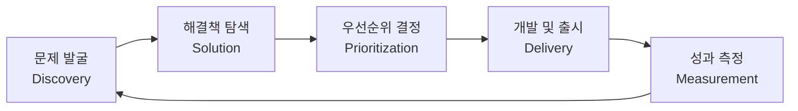

개발자로 일하다 보면 자연스럽게 "이 기능은 왜 이렇게 만들었을까?" 혹은 "사용자가 진짜 원하는 게 이게 맞나?"라는 질문을 하게 된다. 그 질문의 끝에 PM(Product Manager)이라는 역할이 있다.

이 글에서는 PM이 무엇인지, 어떤 역할을 수행하는지, 그리고 개발자 출신이 PM으로 전환할 때 갖는 강점이 무엇인지 정리한다.

---

## PM이란?

PM(Product Manager)은 제품의 방향성과 전략을 정의하고, 개발·디자인·마케팅·비즈니스 등 다양한 팀 간의 협업을 조율하며 제품의 성공적인 출시와 성장을 책임지는 역할이다.

<mark style="background: #FFF3A3A6;">PM은 제품의 "Why"와 "What"과 "When"을 결정하지만, "How"는 주로 개발팀에 위임한다. 그래서 PM을 CEO of the Product라고도 부른다.</mark>

PM은 조직마다 역할의 범위와 깊이가 다르지만, 공통적으로 다음을 담당한다.

- **전략 수립**: 시장 분석, 경쟁사 분석, 사용자 조사를 바탕으로 제품 비전과 로드맵을 수립한다.
- **요구사항 정의**: 사용자 인터뷰, 데이터 분석 등을 통해 진짜 문제를 발굴하고 기능 명세(PRD)를 작성한다.
- **우선순위 결정**: 리소스는 항상 한정되어 있기 때문에 어떤 기능을 언제 만들지를 결정하는 것이 PM의 핵심 업무다.
- **스테이크홀더 관리**: 경영진, 고객, 개발팀 등 다양한 이해관계자의 기대를 조율한다.
- **성과 측정**: 출시 후 KPI와 지표를 추적하며 제품을 지속적으로 개선한다.

---

## Technical PM vs Product PM

일반적인 PM과 Technical PM(TPM)은 하는 일이 유사하지만, TPM은 기술적 배경을 바탕으로 더 복잡한 엔지니어링 맥락을 다룬다.

| 구분 | Product PM | Technical PM |
|---|---|---|
| 주요 배경 | 비즈니스, 기획 | 개발, 엔지니어링 |
| 중점 영역 | 사용자 경험, 시장 전략 | 시스템 아키텍처, API, 인프라 |
| 소통 대상 | 마케팅, 영업, 경영진 | 백엔드·프론트 개발자, DevOps |
| 주요 산출물 | PRD, 로드맵, GTM 전략 | 기술 스펙, 시스템 설계서 |

<mark style="background: #FFF3A3A6;">개발자 출신 PM은 엔지니어링 팀과 소통할 때 기술 맥락을 이해하고 더 정확한 요구사항을 정의할 수 있다는 강점을 가진다. 구현 가능성과 비용을 직관적으로 파악하기 때문에 실현 불가능한 요구사항을 사전에 걸러낼 수 있다.</mark>

---

## 제품 개발 프로세스

PM 중심의 제품 개발 프로세스는 크게 Discovery와 Delivery로 나뉜다.



### Discovery (문제 발굴)
- **사용자 인터뷰**: 실제 사용자와 대화하며 痛點(페인 포인트)을 발굴한다. "어떤 기능이 필요하세요?"보다 "현재 가장 불편한 점이 뭐예요?"라고 질문하는 것이 핵심이다.
- **데이터 분석**: 퍼널 분석, 코호트 분석, 이탈률 분석 등을 통해 정량적 근거를 수집한다.
- **경쟁사 분석**: 유사 제품이 문제를 어떻게 해결하고 있는지 파악한다.

### Delivery (개발 및 출시)
- **PRD 작성**: 기능의 목적, 사용자 스토리, 성공 지표, 엣지 케이스를 명확히 기술한다.
- **스프린트 운영**: 개발팀과 함께 스프린트를 계획하고 데일리 스탠드업에서 블로커를 제거한다.
- **QA 및 출시**: 출시 전 테스트를 검증하고 롤아웃 전략(Feature Flag, A/B 테스트 등)을 결정한다.

---

## 핵심 PM 프레임워크

### OKR (Objectives and Key Results)

OKR은 목표(Objective)와 핵심 결과(Key Results)를 연결하는 목표 관리 프레임워크다. 구글, 인텔, 스포티파이 등 많은 글로벌 기업이 사용한다.

<span style="background-color:#fff5b1">Objective</span>는 정성적이고 야심 찬 목표를 기술하고, <span style="background-color:#fff5b1">Key Results</span>는 목표 달성 여부를 측정할 수 있는 정량 지표 2~5개로 구성한다.

```
Objective: 사용자 온보딩 경험을 획기적으로 개선한다
  KR1: 회원가입 완료율을 60% → 80%로 높인다
  KR2: 최초 핵심 기능 사용까지 걸리는 시간을 5분 이내로 단축한다
  KR3: 온보딩 완료 후 7일 잔존율을 40% → 55%로 높인다
```

OKR에서 Key Results가 전부 100% 달성되었다면 목표가 충분히 도전적이지 않았다고 본다. 일반적으로 70% 달성을 건강한 수준으로 본다.

### RICE 프레임워크 (우선순위 결정)

한정된 리소스 속에서 무엇을 먼저 만들지 결정하는 것이 PM의 가장 어려운 일 중 하나다. RICE는 이를 수치화하는 프레임워크다.

$$RICE\ Score = \frac{Reach \times Impact \times Confidence}{Effort}$$

| 항목 | 설명 | 예시 |
|---|---|---|
| Reach | 해당 기능을 사용할 사용자 수 (월 기준) | 1,000명 |
| Impact | 사용자당 영향도 (0.25 ~ 3배) | 2.0 |
| Confidence | 예측 신뢰도 (%) | 80% |
| Effort | 개발 공수 (person-month) | 2 |

$$RICE = \frac{1000 \times 2.0 \times 0.8}{2} = 800$$

RICE 점수가 높을수록 우선순위를 높게 가져간다. 다만 점수는 참고 지표일 뿐이며, 전략적 맥락과 함께 판단해야 한다.

### AARRR (성장 지표 모델)

스타트업과 B2C 서비스에서 많이 쓰이는 성장 퍼널 모델이다.

| 단계 | 설명 | 핵심 지표 |
|---|---|---|
| Acquisition | 사용자가 어떻게 서비스에 유입되는가 | 채널별 트래픽, CAC |
| Activation | 사용자가 처음 가치를 경험하는가 | 핵심 기능 사용률, 회원가입 완료율 |
| Retention | 사용자가 다시 돌아오는가 | DAU/MAU, 잔존율 |
| Revenue | 사용자가 실제로 돈을 쓰는가 | ARPU, LTV, 전환율 |
| Referral | 사용자가 자발적으로 퍼뜨리는가 | NPS, 초대 전환율 |

<mark style="background: #FFF3A3A6;">AARRR의 핵심은 각 단계에서의 이탈률을 파악하는 것이다. 어느 단계에서 가장 많이 이탈하는지를 찾아야 개선 우선순위를 정확히 설정할 수 있다.</mark>

### North Star Metric

North Star Metric은 제품의 장기적인 성장을 대표하는 단 하나의 지표다. 모든 팀이 같은 방향을 바라보게 만드는 역할을 한다.

- **Airbnb**: 예약된 숙박 일수
- **Spotify**: 월간 청취 시간
- **Slack**: 주간 메시지 발송 수
- **YouTube**: 시청 시간

North Star Metric은 수익 지표(Revenue)가 아니라 고객이 실제로 제품에서 가치를 얻고 있음을 보여주는 지표여야 한다. 수익은 NSM의 결과로 따라온다.

---

## PRD (Product Requirements Document)

PRD는 PM이 만드는 가장 중요한 산출물 중 하나다. 기능의 배경, 목표, 요구사항, 성공 기준, 엣지 케이스를 한 곳에 정리한 문서다.

### PRD 주요 구성 요소

**1. Problem Statement**  
이 기능이 해결하고자 하는 문제를 명확히 기술한다. "우리는 무엇을 만들까?"가 아니라 "왜 만드는가?"로 시작해야 한다.

**2. Goals & Success Metrics**  
기능이 성공했다는 것을 어떻게 판단할지를 정량 지표로 정의한다.
```
목표: 결제 완료율을 높인다
성공 지표: 결제 페이지 진입 후 완료율 72% → 80% (4주 후 측정)
```

**3. User Stories**  
사용자 관점에서 기능을 기술한다.
```
As a [사용자 유형], I want to [원하는 행동], so that [얻는 가치]

예시:
As a 신규 사용자, I want to 소셜 로그인으로 빠르게 가입하고 싶다,
so that 복잡한 회원가입 절차 없이 바로 서비스를 이용할 수 있다.
```

**4. Scope (In/Out)**  
이번 버전에서 포함되는 것과 제외되는 것을 명확히 구분한다. 스코프 크리프(scope creep)를 방지하기 위해 반드시 필요하다.

**5. Edge Cases & Constraints**  
기술적 제약, 법적 이슈, 예외 케이스 등을 사전에 정의한다. 개발자 출신 PM은 이 부분에서 강점을 가진다.

---

## PM이 자주 쓰는 도구

| 카테고리 | 도구 |
|---|---|
| 로드맵 관리 | Jira, Linear, Notion, Productboard |
| 사용자 분석 | Amplitude, Mixpanel, Google Analytics |
| A/B 테스트 | Optimizely, Firebase A/B Testing, GrowthBook |
| 프로토타이핑 | Figma, Framer |
| 사용자 리서치 | Maze, UserTesting, Hotjar |
| 문서화 | Confluence, Notion |
| 소통 | Slack, Linear, GitHub Discussions |

---

## 개발자 출신 PM의 강점과 주의점

### 강점

**1. 기술적 실현 가능성 판단**  
"이 기능은 API 하나로 해결되는데 왜 3주가 걸리지?"라는 질문에 직관적으로 답할 수 있다. 개발 공수를 과소평가하거나 과대평가하는 오류를 줄일 수 있다.

**2. 엔지니어링 팀과의 신뢰 형성**  
코드를 직접 읽고 시스템 설계를 이해할 수 있기 때문에, 개발팀이 기술 부채나 아키텍처 이슈를 설명할 때 빠르게 이해하고 의사결정을 내릴 수 있다.

**3. 데이터 기반 사고**  
개발자 특유의 논리적 사고 방식은 가설 설정 → 실험 설계 → 검증이라는 PM의 반복 업무에 잘 맞는다.

**4. 기술 스택 이해**  
플랫폼 선택, 인프라 비용, 보안 이슈 등 비기술직 PM이 놓치기 쉬운 영역을 커버할 수 있다.

### 주의점

**1. 솔루션 우선 사고 경계**  
개발자 출신은 문제보다 해결책을 먼저 생각하는 경향이 있다. "이렇게 구현하면 되잖아"보다 "이게 진짜 문제인가?"를 먼저 물어야 한다.

**2. 사용자 공감 능력 개발**  
코드는 논리적이지만 사용자는 그렇지 않다. 기술적으로 완벽한 제품이 외면받는 이유는 대부분 사용성이나 가치 전달에 있다.

**3. 이해관계자 소통 방식**  
개발자 문화의 직설적이고 기술 중심적인 소통 방식은 경영진이나 영업팀과의 소통에서 마찰을 일으킬 수 있다. 청중에 따라 언어와 추상화 수준을 조정하는 것이 중요하다.

---

## 마치며

PM은 "모든 것을 알아야 하는 사람"이 아니라 "올바른 질문을 할 줄 아는 사람"이다. 기술, 비즈니스, 사용자 세 가지 관점을 균형 있게 바라보며 팀이 올바른 방향을 향해 나아가도록 돕는 것이 PM의 본질이다.

개발자로서 쌓아온 기술적 깊이는 PM으로 전환할 때 강력한 무기가 된다. 중요한 것은 그 무기를 사용자 문제 해결에 집중하는 방향으로 재정렬하는 것이다.
