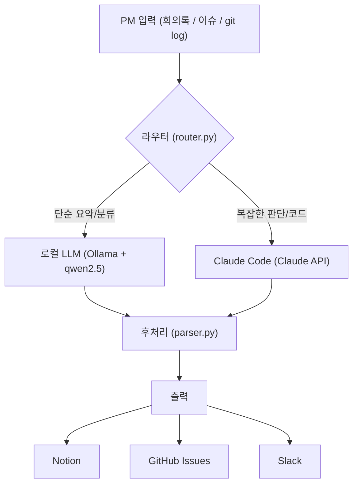

PM으로 일하면서 가장 많이 하는 작업은 반복적인 문서 작업이다. 회의록 요약, 스펙 초안, 이슈 우선순위 정리... 이 루틴을 AI 에이전트로 자동화하면 얼마나 달라질까? 직접 구현해봤다. 로컬 LLM(Ollama + Mistral)과 Claude Code를 조합한 PM 워크플로우 에이전트다.

---

## 왜 로컬 LLM인가?

클라우드 API는 편하지만, 회사 내부 문서나 미팅 내용을 외부 서버로 보내는 건 보안 이슈가 따른다. 로컬 LLM은:

- **보안**: 인터넷 없이 동작하며 민감한 내부 데이터가 외부로 나가지 않는다
- **비용**: API 호출 비용이 없다. 반복 작업이 많을수록 절감 효과가 커진다
- **속도**: 네트워크 레이턴시가 없어 로컬 워크플로우에서 빠르게 응답한다
- **오프라인**: 인터넷 연결 없이도 에이전트를 실행할 수 있다

<mark style="background: #FFF3A3A6;">다만 로컬 LLM은 클라우드 API 대비 추론 능력이 제한적이다. 긴 컨텍스트 처리, 복잡한 코드 생성, 정밀한 판단이 필요한 작업은 Claude Code에 위임하는 역할 분리가 핵심이다.</mark>

---

## Ollama 설치 및 모델 설정

### Ollama 설치

[ollama.com](https://ollama.com)에서 macOS/Linux/Windows 설치 파일을 받거나 아래 명령어로 설치한다.

```bash
# macOS
brew install ollama

# Linux
curl -fsSL https://ollama.com/install.sh | sh
```

설치 후 서버를 실행한다.

```bash
ollama serve
```

기본 포트는 `11434`이며, `http://localhost:11434`로 REST API가 열린다.

### 모델 선택 가이드

로컬 LLM은 모델 크기와 성능 사이의 트레이드오프가 크다. PM 업무 자동화 용도에서 실용적인 모델들을 비교하면 다음과 같다.

| 모델 | 크기 | 메모리 요구 | 한국어 지원 | 용도 |
|---|---|---|---|---|
| mistral:7b | 4.1GB | 8GB RAM | 보통 | 일반 요약, 분류 |
| llama3.1:8b | 4.7GB | 8GB RAM | 보통 | 범용 |
| gemma3:12b | 8.1GB | 16GB RAM | 양호 | 긴 문서 처리 |
| qwen2.5:14b | 9GB | 16GB RAM | 우수 | 한국어 중심 작업 |
| llama3.1:70b | 40GB | 64GB RAM | 우수 | 고품질 추론 |

한국어 문서를 주로 다루는 PM이라면 `qwen2.5:14b`가 실용적인 선택이다.

```bash
# 모델 다운로드 (최초 1회)
ollama pull qwen2.5:14b

# 실행 테스트
ollama run qwen2.5:14b "PRD란 무엇인가?"
```

---

## 에이전트 전체 아키텍처



에이전트는 크게 세 레이어로 구성된다.

1. **라우터(Router)**: 입력 태스크의 복잡도를 판단해 로컬 LLM과 Claude Code 중 어디로 보낼지 결정한다.
2. **프로세서(Processor)**: 각 LLM에 맞는 프롬프트로 실제 작업을 수행한다.
3. **싱크(Sink)**: 결과를 Notion, GitHub, Slack 등 PM 도구로 내보낸다.

---

## 환경 세팅

```bash
mkdir pm-agent && cd pm-agent
python -m venv .venv && source .venv/bin/activate

pip install ollama anthropic python-dotenv notion-client slack-sdk
```

```
# .env
ANTHROPIC_API_KEY=sk-ant-...
NOTION_TOKEN=secret_...
NOTION_DATABASE_ID=...
SLACK_BOT_TOKEN=xoxb-...
SLACK_CHANNEL_ID=C0...
```

---

## 회의록 요약 에이전트

회의록을 넣으면 결정 사항, 액션 아이템, 리스크를 구조화해서 추출한다.

```python
# agents/meeting_summarizer.py
import ollama

PROMPT_TEMPLATE = """다음 회의록을 PM 관점에서 분석해줘.
아래 형식으로 정확히 출력해:

## 결정 사항
- (결정된 내용을 bullet로)

## 액션 아이템
| 항목 | 담당자 | 기한 |
|---|---|---|
| ... | ... | ... |

## 리스크 / 미결 사항
- (리스크나 추가 논의 필요 항목)

회의록:
{transcript}"""


def summarize_meeting(transcript: str) -> str:
    response = ollama.chat(
        model='qwen2.5:14b',
        messages=[{
            'role': 'user',
            'content': PROMPT_TEMPLATE.format(transcript=transcript)
        }]
    )
    return response['message']['content']


if __name__ == '__main__':
    sample = """
    참석: 김개발, 박디자인, 이PM
    일시: 2026-05-20

    이PM: 이번 스프린트 결제 모듈 오류 원인 파악됐나요?
    김개발: 네, PG사 웹훅 응답 타임아웃이 원인이었습니다. 재시도 로직 추가하면 됩니다.
    이PM: 기한은요?
    김개발: 수요일까지 가능합니다.
    박디자인: 에러 화면 UI도 같이 수정할게요. 목요일 드리겠습니다.
    이PM: 좋습니다. 이번 주 금요일 핫픽스 배포 목표로 진행하죠.
    """
    print(summarize_meeting(sample))
```

---

## PRD 초안 자동 생성 에이전트

사용자 피드백이나 이슈 메모를 입력하면 PRD 초안을 작성해준다. 이 작업은 컨텍스트가 길고 구조화된 출력이 필요하기 때문에 Claude API를 사용한다.

```python
# agents/prd_drafter.py
import anthropic

client = anthropic.Anthropic()

PRD_SYSTEM_PROMPT = """당신은 경험 많은 Technical PM입니다.
입력된 문제 설명을 바탕으로 PRD(Product Requirements Document) 초안을 작성합니다.
PRD는 다음 섹션을 포함해야 합니다:
1. Problem Statement
2. Goals & Success Metrics
3. User Stories
4. Scope (In / Out of Scope)
5. Edge Cases & Constraints
마크다운 형식으로 작성하세요."""


def draft_prd(problem_description: str) -> str:
    message = client.messages.create(
        model="claude-opus-4-5",
        max_tokens=2048,
        system=PRD_SYSTEM_PROMPT,
        messages=[{
            "role": "user",
            "content": f"다음 문제를 해결하는 기능의 PRD를 작성해줘:\n\n{problem_description}"
        }]
    )
    return message.content[0].text


if __name__ == '__main__':
    problem = """
    사용자들이 비밀번호를 자주 잊어버려서 고객센터 문의의 30%가 비밀번호 초기화 관련이다.
    소셜 로그인(Google, Kakao)을 도입하면 이 문제를 해결하고 신규 가입 전환율도 올릴 수 있다.
    """
    print(draft_prd(problem))
```

---

## 이슈 우선순위 분류 에이전트 (MoSCoW)

GitHub Issues나 Jira 티켓 목록을 입력받아 MoSCoW 프레임워크로 분류한다.

```python
# agents/issue_prioritizer.py
import ollama
import json

MOSCOW_PROMPT = """다음 이슈 목록을 MoSCoW 프레임워크로 분류해줘.

분류 기준:
- Must Have: 서비스 운영에 필수, 없으면 출시 불가
- Should Have: 중요하지만 잠시 미룰 수 있음
- Could Have: 있으면 좋지만 우선순위 낮음
- Won't Have: 이번 스프린트에서 하지 않음

반드시 JSON 형식으로만 응답해:
{{
  "must": ["이슈1", "이슈2"],
  "should": ["이슈3"],
  "could": ["이슈4"],
  "wont": ["이슈5"]
}}

이슈 목록:
{issues}"""


def prioritize_issues(issues: list[str]) -> dict:
    issues_text = '\n'.join(f'- {issue}' for issue in issues)

    response = ollama.chat(
        model='qwen2.5:14b',
        messages=[{
            'role': 'user',
            'content': MOSCOW_PROMPT.format(issues=issues_text)
        }],
        format='json'
    )

    return json.loads(response['message']['content'])


if __name__ == '__main__':
    issues = [
        "결제 실패 시 사용자에게 에러 메시지 표시 안됨 (버그)",
        "다크모드 지원",
        "프로필 이미지 편집 기능",
        "소셜 로그인 도입",
        "앱 아이콘 리디자인",
        "세션 만료 시 자동 로그아웃 처리 없음 (보안)",
        "푸시 알림 개인화 설정",
    ]
    result = prioritize_issues(issues)
    for category, items in result.items():
        print(f"\n[{category.upper()}]")
        for item in items:
            print(f"  - {item}")
```

---

## 릴리스 노트 자동 생성 에이전트

`git log`를 기반으로 사용자 친화적인 릴리스 노트를 생성한다.

```python
# agents/release_note_generator.py
import subprocess
import ollama


def get_git_log(n: int = 30) -> str:
    result = subprocess.run(
        ['git', 'log', f'--oneline', f'-{n}'],
        capture_output=True, text=True
    )
    return result.stdout.strip()


RELEASE_PROMPT = """다음 git commit 목록을 바탕으로 릴리스 노트를 작성해줘.

규칙:
- 개발자 용어 대신 사용자 관점의 언어로 작성
- 🚀 신기능, 🐛 버그 수정, ⚡ 성능 개선, 🔒 보안 패치로 아이콘 구분
- 내부 리팩토링이나 CI 변경은 제외
- 간결하고 명확하게

git log:
{git_log}"""


def generate_release_notes(version: str = "v1.0.0") -> str:
    git_log = get_git_log()

    response = ollama.chat(
        model='qwen2.5:14b',
        messages=[{
            'role': 'user',
            'content': RELEASE_PROMPT.format(git_log=git_log)
        }]
    )

    notes = response['message']['content']
    return f"# Release Notes {version}\n\n{notes}"


if __name__ == '__main__':
    print(generate_release_notes("v2.3.0"))
```

---

## 태스크 라우터 — 로컬 LLM vs Claude 자동 선택

복잡도에 따라 어느 LLM을 사용할지 자동으로 결정하는 라우터다.

```python
# router.py
from enum import Enum

class TaskType(Enum):
    SIMPLE_SUMMARY = "simple_summary"       # 로컬 LLM
    ISSUE_CLASSIFICATION = "classification" # 로컬 LLM
    RELEASE_NOTES = "release_notes"         # 로컬 LLM
    PRD_DRAFT = "prd_draft"                 # Claude
    COMPLEX_ANALYSIS = "complex_analysis"   # Claude
    CODE_REVIEW = "code_review"             # Claude

LOCAL_TASKS = {
    TaskType.SIMPLE_SUMMARY,
    TaskType.ISSUE_CLASSIFICATION,
    TaskType.RELEASE_NOTES,
}

CLAUDE_TASKS = {
    TaskType.PRD_DRAFT,
    TaskType.COMPLEX_ANALYSIS,
    TaskType.CODE_REVIEW,
}


def route(task_type: TaskType, payload: str) -> str:
    if task_type in LOCAL_TASKS:
        return _run_local(task_type, payload)
    elif task_type in CLAUDE_TASKS:
        return _run_claude(task_type, payload)
    else:
        raise ValueError(f"Unknown task type: {task_type}")


def _run_local(task_type: TaskType, payload: str) -> str:
    import ollama
    response = ollama.chat(
        model='qwen2.5:14b',
        messages=[{'role': 'user', 'content': payload}]
    )
    return response['message']['content']


def _run_claude(task_type: TaskType, payload: str) -> str:
    import anthropic
    client = anthropic.Anthropic()
    message = client.messages.create(
        model="claude-opus-4-5",
        max_tokens=2048,
        messages=[{"role": "user", "content": payload}]
    )
    return message.content[0].text
```

---

## Notion 연동

에이전트가 생성한 문서를 Notion 데이터베이스에 자동으로 저장한다.

```python
# sinks/notion_sink.py
import os
from notion_client import Client

notion = Client(auth=os.environ["NOTION_TOKEN"])
DATABASE_ID = os.environ["NOTION_DATABASE_ID"]


def push_to_notion(title: str, content: str, doc_type: str = "PM Doc") -> str:
    """생성된 문서를 Notion 데이터베이스에 저장하고 페이지 URL을 반환한다."""
    response = notion.pages.create(
        parent={"database_id": DATABASE_ID},
        properties={
            "Name": {"title": [{"text": {"content": title}}]},
            "Type": {"select": {"name": doc_type}},
            "Status": {"select": {"name": "Draft"}},
        },
        children=[
            {
                "object": "block",
                "type": "paragraph",
                "paragraph": {
                    "rich_text": [{"type": "text", "text": {"content": content[:2000]}}]
                }
            }
        ]
    )
    return response["url"]


if __name__ == '__main__':
    from dotenv import load_dotenv
    load_dotenv()

    url = push_to_notion(
        title="소셜 로그인 기능 PRD",
        content="## Problem Statement\n비밀번호 분실 문의가 전체 CS의 30%를 차지...",
        doc_type="PRD"
    )
    print(f"Notion 페이지 생성 완료: {url}")
```

---

## Slack 알림 연동

작업 완료 시 담당자에게 Slack으로 결과를 전달한다.

```python
# sinks/slack_sink.py
import os
from slack_sdk import WebClient

slack = WebClient(token=os.environ["SLACK_BOT_TOKEN"])
CHANNEL = os.environ["SLACK_CHANNEL_ID"]


def notify_slack(summary: str, doc_url: str = None) -> None:
    blocks = [
        {
            "type": "section",
            "text": {"type": "mrkdwn", "text": f"🤖 *PM 에이전트 작업 완료*\n\n{summary[:500]}"}
        }
    ]
    if doc_url:
        blocks.append({
            "type": "actions",
            "elements": [{
                "type": "button",
                "text": {"type": "plain_text", "text": "Notion에서 보기"},
                "url": doc_url
            }]
        })

    slack.chat_postMessage(channel=CHANNEL, blocks=blocks)
```

---

## Claude Code 활용 팁

Claude Code는 단순 코드 에디터가 아니라 **에이전트 프레임워크**로 쓸 수 있다.

### CLI로 배치 작업

```bash
# git log 기반 릴리스 노트 자동 생성
claude --print "다음 git log를 기반으로 릴리스 노트를 작성해줘: $(git log --oneline -20)"

# 파일 읽어서 PRD 작성
claude --print "$(cat meeting_notes.txt)를 바탕으로 PRD 초안을 작성해줘"
```

### CLAUDE.md로 컨텍스트 영속화

세션 간 컨텍스트 유지가 필요하면 `CLAUDE.md`에 프로젝트 배경을 저장해두면 된다. 매번 반복 설명 없이 바로 작업에 들어갈 수 있다.

```markdown
# CLAUDE.md 예시

## 제품 개요
- 서비스명: [서비스명]
- 타겟 사용자: 20-30대 직장인
- 핵심 가치: 업무 효율화

## PM 용어 정의
- Sprint: 2주 단위 개발 사이클
- PRD: Product Requirements Document
- NSM: North Star Metric — 월간 활성 사용자 수

## 현재 분기 OKR
- O: 결제 전환율 개선
- KR1: 결제 완료율 72% → 80%
- KR2: 결제 페이지 이탈률 28% → 18%
```

### 파이프라인에서 Claude Code 호출

```python
# agents/claude_code_agent.py
import subprocess


def run_claude_code(prompt: str) -> str:
    """Claude Code CLI를 서브프로세스로 호출한다."""
    result = subprocess.run(
        ['claude', '--print', prompt],
        capture_output=True,
        text=True,
        cwd='/path/to/project'  # CLAUDE.md가 있는 프로젝트 루트
    )
    return result.stdout.strip()
```

<mark style="background: #FFF3A3A6;">Claude Code를 서브프로세스로 호출할 때는 `--print` 플래그를 사용해 non-interactive 모드로 실행하고, `cwd`를 CLAUDE.md가 있는 프로젝트 루트로 지정해야 컨텍스트가 올바르게 로드된다.</mark>

---

## 전체 파이프라인 실행 예시

```python
# main.py
import os
from dotenv import load_dotenv

from agents.meeting_summarizer import summarize_meeting
from agents.prd_drafter import draft_prd
from agents.issue_prioritizer import prioritize_issues
from agents.release_note_generator import generate_release_notes
from sinks.notion_sink import push_to_notion
from sinks.slack_sink import notify_slack

load_dotenv()


def run_meeting_pipeline(transcript: str):
    print("📝 회의록 요약 중...")
    summary = summarize_meeting(transcript)

    print("📤 Notion에 저장 중...")
    url = push_to_notion(title="회의록 요약", content=summary, doc_type="Meeting Note")

    print("💬 Slack 알림 전송...")
    notify_slack(summary=summary[:300], doc_url=url)

    print(f"✅ 완료: {url}")
    return url


def run_sprint_pipeline(issues: list[str], git_log_count: int = 20):
    print("🎯 이슈 우선순위 분류 중...")
    priorities = prioritize_issues(issues)

    print("📋 릴리스 노트 생성 중...")
    release_notes = generate_release_notes()

    content = f"## 이슈 우선순위\n{priorities}\n\n## 릴리스 노트\n{release_notes}"
    url = push_to_notion(title="스프린트 리뷰", content=content, doc_type="Sprint Review")

    notify_slack(summary="스프린트 리뷰 문서가 생성되었습니다.", doc_url=url)
    return url


if __name__ == '__main__':
    # 사용 예시
    with open('today_meeting.txt') as f:
        transcript = f.read()
    run_meeting_pipeline(transcript)
```

---

## 비용 비교

월 200회 PM 문서 자동화 작업 기준 추정치다.

| 방식 | 월 비용 | 비고 |
|---|---|---|
| GPT-4o API 전량 사용 | $40~80 | 입출력 토큰 기준 |
| Claude API 전량 사용 | $30~60 | claude-opus 기준 |
| 로컬 LLM 전량 사용 | $0 | 전기세 제외 |
| **로컬 + Claude 혼합** | **$5~15** | 복잡한 작업만 Claude |

<mark style="background: #FFF3A3A6;">단순 반복 작업 80%를 로컬 LLM으로 처리하면 API 비용을 70~80% 절감하면서도 복잡한 작업에서는 Claude의 품질을 유지할 수 있다.</mark>

---

## 마치며

**로컬 LLM으로 일상 반복 작업을, Claude Code로 복잡한 판단이 필요한 작업을 처리하는 분리 구조가 PM 에이전트 설계의 핵심이다.**

처음에는 회의록 요약 하나만 자동화해도 하루 30분을 아낄 수 있다. 여기에 이슈 분류, PRD 초안, 릴리스 노트까지 더하면 PM이 실제로 집중해야 할 일 등 사용자 인터뷰, 전략 수립, 팀 조율 등에 쓸 수 있는 시간이 늘어난다.
